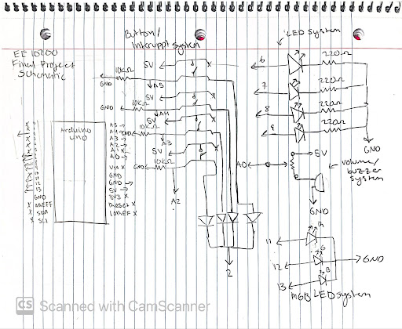
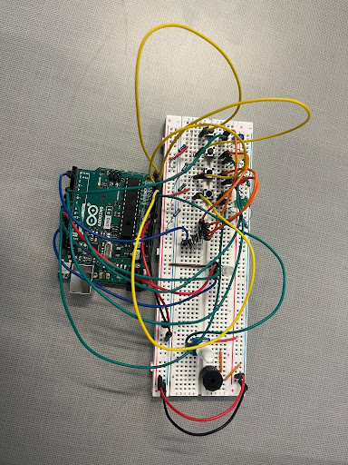

# Arduino Multi-Button Interactive Music Box

**Author:** Heather Schwartz  
**Course:** EE 10200  

An Arduino-powered interactive jukebox featuring a custom diode-OR hardware interrupt circuit, real-time volume/brightness analog control, and dynamic RGB light shows mapped directly to note frequencies across a chromatic scale.

---

## Technical Highlights

- **Hardware Interrupt Trick:** Overcame the Arduino Uno's 2-interrupt pin limit by combining a 4-button **diode-OR logic gate** into a single interrupt pin (`Pin 2`) while polling individual analog pins (`A2–A5`) to decode active inputs.
- **Tone-to-Color Frequency Mapping:** Implemented custom C++ `struct` definitions to bind 27 chromatic note frequencies directly to 24-bit RGB values, creating an intuitive visual representation of musical pitch.
- **Real-Time Dynamic Analog Scaling:** Single potentiometer voltage divider configuration concurrently adjusts piezo volume and dynamically scales RGB LED PWM brightness percentages.

---

## Hardware Architecture & Circuitry

### Key Components
- **Microcontroller:** Arduino Uno R3
- **Sensors & Input:** 4x Pushbuttons, 1x 10kΩ Potentiometer (Analog Input)
- **Actuators & Display:** 1x Piezo Buzzer, 1x Common-Cathode RGB LED, 4x Indicator LEDs
- **Discrete Electronics:** 4x Diodes (Interrupt OR-Logic), 4x 220Ω Current-Limiting Resistors, 4x 10kΩ Pull-down Resistors

### Circuit Diagram & Physical Setup
| Schematic | Physical Breadboard |
| :---: | :---: |
|  |  |

### Pin Map
| Component / Function | Arduino Pin | Circuit Type |
| :--- | :--- | :--- |
| **Interrupt Trigger** | `Pin 2` | Digital Input (RISING, Diode Bus) |
| **Button Inputs (Blue / Yellow / Red / Green)** | `A5`, `A4`, `A3`, `A2` | Analog Input (>500 Threshold) |
| **Indicator LEDs (Blue / Yellow / Red / Green)** | `Pin 6`, `Pin 7`, `Pin 8`, `Pin 9` | Digital Output (220Ω Resistors) |
| **RGB LED (Red / Green / Blue)** | `Pin 11`, `Pin 12`, `Pin 13` | PWM Output |
| **Potentiometer & Piezo Volume Control** | `A0` | Analog Input (Voltage Divider) |

---

## Software Design

### Data Structures
To synchronize pitch and visuals without hardcoding color values across melodies, notes are defined using custom C-structures:

```cpp
struct Note {
  int freq; // Tone frequency in Hz
  int r;    // Red PWM value (0-255)
  int g;    // Green PWM value (0-255)
  int b;    // Blue PWM value (0-255)
};

struct MelodyStep {
  Note note;
  int duration; // Note duration in ms
};
