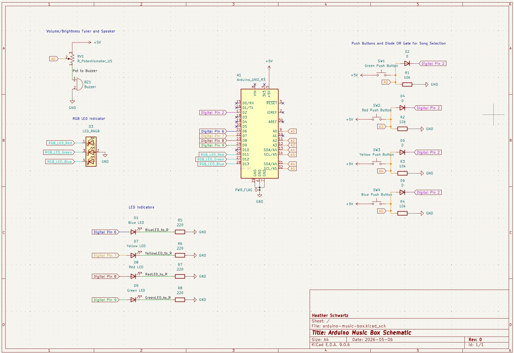
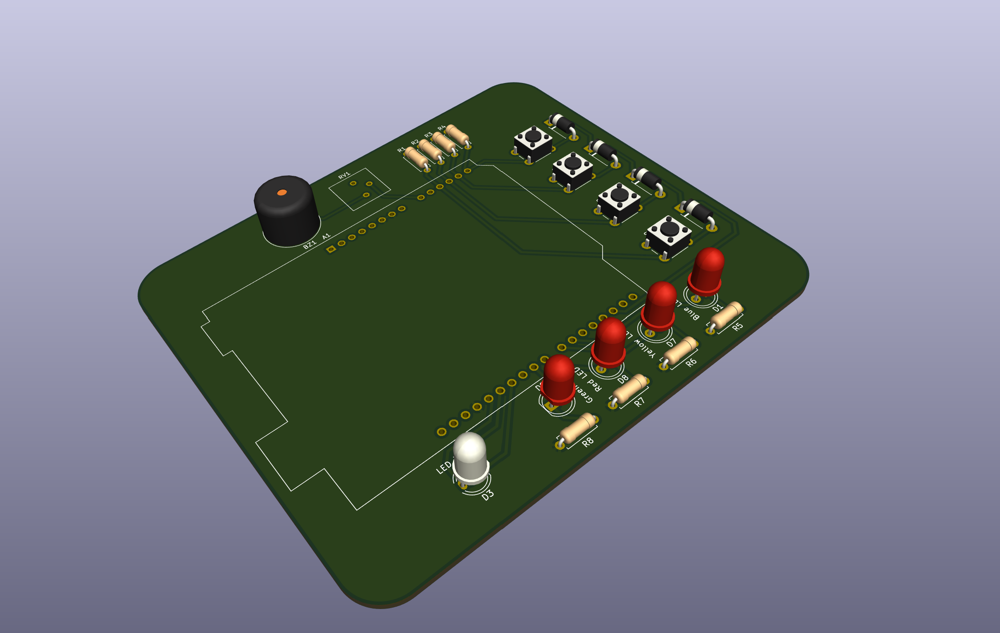

# Arduino Interactive Music Box & Custom PCB Shield

A complete embedded hardware and firmware system built around the ATmega328P (Arduino Uno R3) platform. This project features a custom-designed 2-layer PCB shield, real-time song switching via dynamic loop interrupts, tone-synced 24-bit RGB lighting, diode-OR hardware logic, and dynamic potentiometer audio scaling

Designed, routed, and documented using **KiCad 9.0**.

---

## Key Technical Features

* **Custom 2-Layer PCB Shield:** Designed a custom PCB in KiCad that plugs directly onto an Arduino Uno R3, featuring optimized ground pours, clean trace routing, and through-hole component footprints.
* **Diode-OR Hardware Interrupt Circuit:** Bypasses hardware pin constraints on the ATmega328P by multiplexing 4 active-high pushbuttons into a single interrupt pin (`Digital Pin 2`) using 1N4148 switching diodes.
* **Real-Time Input Polling:** Uses analog pins (`A2–A5`) as digital inputs with 10k Ohm pull-down resistors to instantly decode button presses after triggering the ISR.
* **Dynamic Song Interruption:** Firmware regularly checks an interrupt flag during song playback loops to provide instantaneous song cancellation and input switching.
* **Tone-to-Color RGB Mapping:** Embedded C++ data structures map 27 chromatic note frequencies to 24-bit RGB values, creating custom visual lighting effects synced to audio pitch.
* **Analog Volume & Brightness Control:** Potentiometer voltage divider dynamically scales piezo speaker drive voltage and audio output levels.

---

## Hardware Architecture & Design

### Breadboard Concept

### Schematic Capture


### 3D PCB Layout


* **[View KiCad 9.0 Project Files](hardware/)**

---

## Pin Mapping & Component Specification

| Component | Arduino Pin | Circuit Function |
| :--- | :--- | :--- |
| **Diode-OR Interrupt Line** | `Digital Pin 2 (INT0)` | Common hardware interrupt trigger from all 4 buttons |
| **Blue Active LED** | `Digital Pin 6` | Status indicator (220 Ohms current limiting) |
| **Yellow Active LED** | `Digital Pin 7` | Status indicator (220 Ohms current limiting) |
| **Red Active LED** | `Digital Pin 8` | Status indicator (220 Ohms current limiting) |
| **Green Active LED** | `Digital Pin 9` | Status indicator (220 Ohms current limiting) |
| **RGB LED (Red/Green/Blue)** | `Digital Pins 11, 12, 13` | Frequency-synced chromatic lighting display |
| **Potentiometer & Buzzer** | `Analog Pin A0` | Wiper analog reference and piezo speaker driver |
| **Green Pushbutton Sense** | `Analog Pin A2` | Song 1 selection input |
| **Red Pushbutton Sense** | `Analog Pin A3` | Song 2 selection input |
| **Yellow Pushbutton Sense** | `Analog Pin A4` | Song 3 selection input |
| **Blue Pushbutton Sense** | `Analog Pin A5` | Song 4 selection input |

---

## Circuit & PCB Engineering Highlights

### Diode-OR Hardware Interrupt
Standard ATmega328P microcontrollers feature only two external hardware interrupt pins (`INT0` on Pin 2 and `INT1` on Pin 3). To handle 4 independent pushbutton inputs without continuous software polling, four 1N4148 diodes form a diode-OR logic gate:

1. Pressing any button routes current through its respective diode to pull `Digital Pin 2` `HIGH`.
2. An **Interrupt Service Routine (ISR)** triggers on the rising edge.
3. The MCU polls lines `A2–A5` to identify which specific button was pressed.

### PCB Layout Considerations
* **Board Dimensions:** Form-factor matches standard Arduino Uno R3 header dimensions ($68.6\text{ mm} \times 53.4\text{ mm}$).
* **Ground Pours:** Top and bottom layers utilize solid Ground Planes ($\text{GND}$) for return paths and noise reduction.
* **Trace Parameters:** Signal traces routed at 0.25 mm width; power rails ($5\text{V}$, $\text{GND}$) widened to 0.5 mm for power delivery.

---

## Firmware Architecture

The C++ firmware is built using custom structs that bundle note frequencies, durations, and RGB color vectors:

```cpp
struct Note {
  int frequency;  // Hz
  int duration;   // ms
  byte red;       // 0-255 PWM
  byte green;     // 0-255 PWM
  byte blue;      // 0-255 PWM
};
